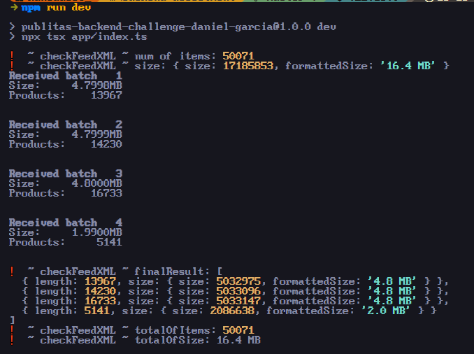

## Summary

This is Daniel Garcia's code challenge for Publitas Junior NodeJs Developer position

## The Task
Write a program that
Parses the product feed XML file in the project.
- For each product, extracts the `id`, `title` and `description`.

- Batches them together and calls the provided external service for each batch
A batch should

Be a JSON encoded array of the form:

```json
[{id: 'id', title: 'title', description: 'description'}, ...]
```
For more details about the format, [click here](https://support.google.com/merchants/answer/7052112).


As close to as possible, but not exceeding 5 megabytes in size

## How to run

```bash
npm install
npm run dev
```

As simple as that!

## Results

